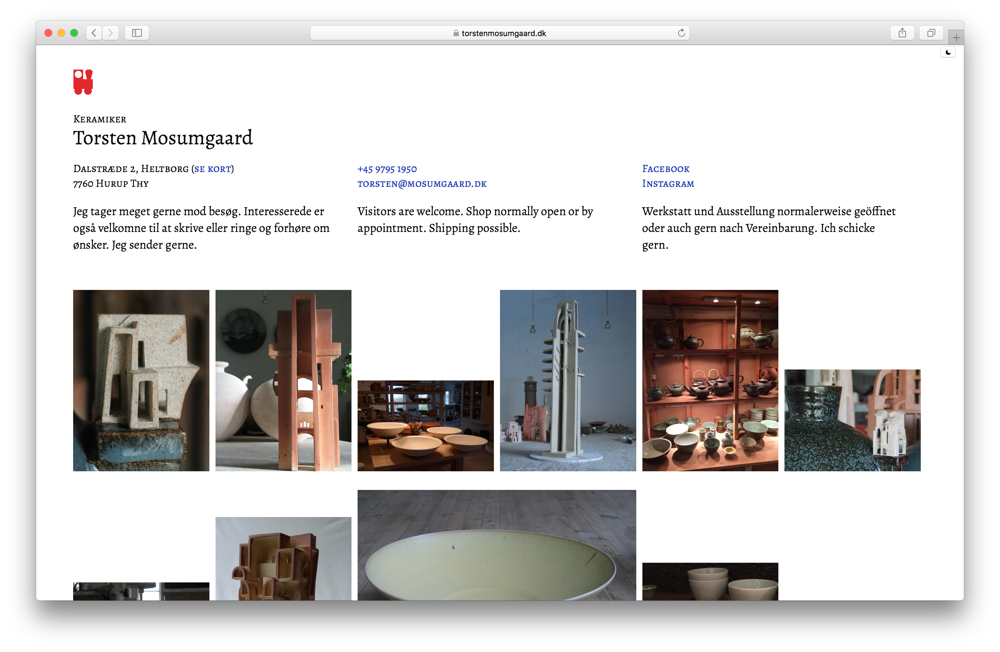

# Torsten Mosumgaard Gallery

This is the source code for the website on https://torstenmosumgaard.dk.

## Highlights

- Images are fetched from a Cloudinary account using https://github.com/oskarrough/torstenmosumgaard-api
- Decent performance
- Modal gallery using PhotoSwipe

## Development

Make surm you have git and node, then do:

* `git clone git@github.com:oskarrough/torstenmosumgaard.dk.git`
* `cd torstenmosumgaard.dk`
* `npm run dev`

### Deploying

The `main` branch is automatically deployed via netlify.com to https://torstenmosumgaard.dk.
